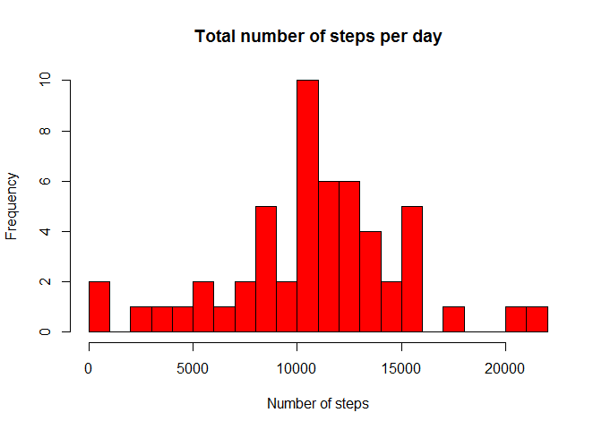
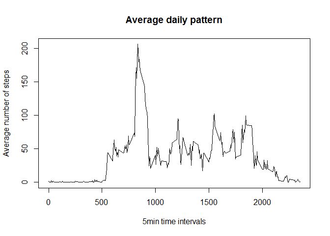
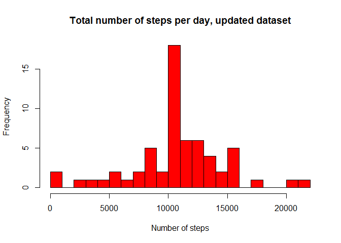
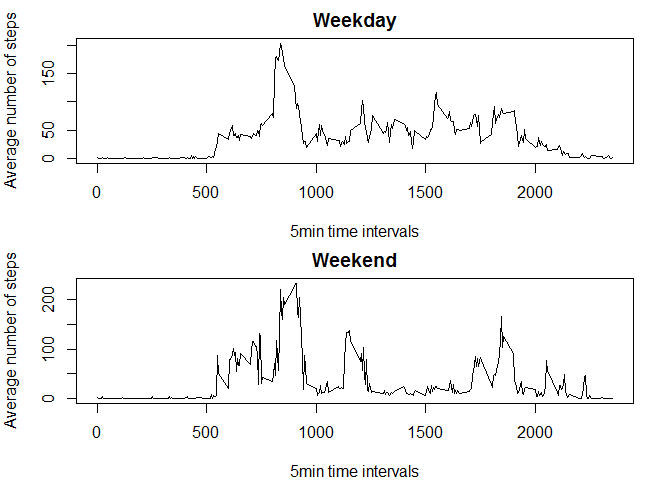

# Reproducible Research: Peer Assessment 1


## Loading and preprocessing the data

After the data are downloaded, they are unziped and processed. NA values are excluded


```r
## Load data

activity<-unzip("activity.zip")
dataset_raw<-read.csv("activity.csv",header=T, sep=",")

## Process data

dataset_raw[,1]<-as.numeric(dataset_raw[,1]) # First column: Steps
dataset_raw[,2]<-as.Date(dataset_raw[,2])   # Second column: Date
dataset=dataset_raw[complete.cases(dataset_raw),]   # Third column: Time
```

## What is mean total number of steps taken per day?

The dataset is grouped by date and the 


```r
## Find daily mean and daily steps

library(dplyr)
```

```
## 
## Attaching package: 'dplyr'
## 
## The following object is masked from 'package:stats':
## 
##     filter
## 
## The following objects are masked from 'package:base':
## 
##     intersect, setdiff, setequal, union
```

```r
dataset_daily=group_by(dataset,date) # group by date
dailytotal=summarise_each(dataset_daily,funs(sum)) # calculate the daily sum
```
The sum of steps per day are:

```r
dailytotal
```

```
## Source: local data frame [53 x 3]
## 
##          date steps interval
## 1  2012-10-02   126   339120
## 2  2012-10-03 11352   339120
## 3  2012-10-04 12116   339120
## 4  2012-10-05 13294   339120
## 5  2012-10-06 15420   339120
## 6  2012-10-07 11015   339120
## 7  2012-10-09 12811   339120
## 8  2012-10-10  9900   339120
## 9  2012-10-11 10304   339120
## 10 2012-10-12 17382   339120
## ..        ...   ...      ...
```
The histogram of the sum of steps per day:

```r
hist(dailytotal$steps,main="Total number of steps per day",xlab="Number of steps",col="red",breaks=20)
```

 
The mean and median of total steps per day are:

```r
meansteps=mean(dailytotal$steps) # mean of total steps
meansteps
```

```
## [1] 10766.19
```

```r
mediansteps=median(dailytotal$steps) # median of total steps
mediansteps
```

```
## [1] 10765
```

## What is the average daily activity pattern?

The dataset is grouped by interval and for each group the mean is calculated.

```r
dataset_pattern=group_by(dataset,interval) # group by interval
dailypattern=summarise_each(dataset_pattern,funs(mean)) # calculate the mean per interval
```
The daily pattern is:

```r
dailypattern
```

```
## Source: local data frame [288 x 3]
## 
##    interval     steps       date
## 1         0 1.7169811 2012-10-30
## 2         5 0.3396226 2012-10-30
## 3        10 0.1320755 2012-10-30
## 4        15 0.1509434 2012-10-30
## 5        20 0.0754717 2012-10-30
## 6        25 2.0943396 2012-10-30
## 7        30 0.5283019 2012-10-30
## 8        35 0.8679245 2012-10-30
## 9        40 0.0000000 2012-10-30
## 10       45 1.4716981 2012-10-30
## ..      ...       ...        ...
```
and the respective plot:

```r
plot(dailypattern$interval,dailypattern$steps,type="l",main="Average daily pattern",xlab="5min time intervals",ylab="Average number of steps")
```

 
The interval where the highest value of average step is met is the following:

```r
maxsteps_interval=subset(dailypattern$interval,dailypattern$steps==max(dailypattern$steps)) # interval with highest mean value per interval
maxsteps_interval
```

```
## [1] 835
```

## Imputing missing values

As an alternative to excluding the NA values, we replace them by the respective value which derives from the daily pattern.

The total number of NA values is:

```r
NAs_location=is.na(dataset_raw$steps) # location of NAs
NAs_number=sum(NAs_location) # total number of NAs
NAs_number
```

```
## [1] 2304
```
A copy of the original dataset is created. When there is an NA value, it is replaced by the respective average steps for the specific interval. The daily pattern is used.


```r
dataset2=dataset_raw # create a new dataset
dailypattern=data.frame(dailypattern[,"interval"],dailypattern[,"steps"]) # create a dataframe with the mean steps per interval
dataset2[NAs_location,"steps"]=dailypattern[(dailypattern[,1] %in% dataset2[NAs_location,"interval"]),2] # replace NAs with the mean step per interval
```
The initial dataset is:

```r
head(dataset_raw)
```

```
##   steps       date interval
## 1    NA 2012-10-01        0
## 2    NA 2012-10-01        5
## 3    NA 2012-10-01       10
## 4    NA 2012-10-01       15
## 5    NA 2012-10-01       20
## 6    NA 2012-10-01       25
```
while now the dataset is transformed into:

```r
head(dataset2)
```

```
##       steps       date interval
## 1 1.7169811 2012-10-01        0
## 2 0.3396226 2012-10-01        5
## 3 0.1320755 2012-10-01       10
## 4 0.1509434 2012-10-01       15
## 5 0.0754717 2012-10-01       20
## 6 2.0943396 2012-10-01       25
```
We check that there are no more NA values:

```r
sum(is.na(dataset2)) # check if NAs are replaced
```

```
## [1] 0
```
For the new dataset, we calculate the daily sum:

```r
dataset2_daily=group_by(dataset2,date) # group by date
dailytotal2=summarise_each(dataset2_daily,funs(sum)) # calculate the daily sum
dailytotal2
```

```
## Source: local data frame [61 x 3]
## 
##          date    steps interval
## 1  2012-10-01 10766.19   339120
## 2  2012-10-02   126.00   339120
## 3  2012-10-03 11352.00   339120
## 4  2012-10-04 12116.00   339120
## 5  2012-10-05 13294.00   339120
## 6  2012-10-06 15420.00   339120
## 7  2012-10-07 11015.00   339120
## 8  2012-10-08 10766.19   339120
## 9  2012-10-09 12811.00   339120
## 10 2012-10-10  9900.00   339120
## ..        ...      ...      ...
```
The respective histogram:

```r
hist(dailytotal2$steps,main="Total number of steps per day, updated dataset",xlab="Number of steps",col="red",breaks=20)
```

 
The new mean and new median values are:

```r
meansteps2=mean(dailytotal2$steps) # mean of total steps
meansteps2
```

```
## [1] 10766.19
```

```r
mediansteps2=median(dailytotal2$steps) # median of total steps
mediansteps2
```

```
## [1] 10766.19
```
## Are there differences in activity patterns between weekdays and weekends?

To identify the difference in the daily pattern of the weekdays versus the weekdays, a new column is added to the dataset.

To identify the weekdays, the dates are transformed to POSIX format.

```r
date_transf=as.POSIXlt(dataset2[,"date"]) # transform the dates to POSIX format
head(date_transf)
```

```
## [1] "2012-10-01 UTC" "2012-10-01 UTC" "2012-10-01 UTC" "2012-10-01 UTC"
## [5] "2012-10-01 UTC" "2012-10-01 UTC"
```
A column "day" is added to the dataset. The column takes values from 0 to 6. Zero stands for Sunday and 6 for Saturday.

```r
dataset2=cbind(dataset2,day=date_transf$wday) # create a new column in the dataset with the respective weekday
head(dataset2)
```

```
##       steps       date interval day
## 1 1.7169811 2012-10-01        0   1
## 2 0.3396226 2012-10-01        5   1
## 3 0.1320755 2012-10-01       10   1
## 4 0.1509434 2012-10-01       15   1
## 5 0.0754717 2012-10-01       20   1
## 6 2.0943396 2012-10-01       25   1
```
The column "day" is transformed to a two-level variable:

```r
dataset2$day=ifelse(dataset2$day==(0|6),"weekend","weekday") # turn the day column to a two-level variable 
head(dataset2)
```

```
##       steps       date interval     day
## 1 1.7169811 2012-10-01        0 weekend
## 2 0.3396226 2012-10-01        5 weekend
## 3 0.1320755 2012-10-01       10 weekend
## 4 0.1509434 2012-10-01       15 weekend
## 5 0.0754717 2012-10-01       20 weekend
## 6 2.0943396 2012-10-01       25 weekend
```
The dataset is grouped by day and by interval.

```r
dataset2_weekday=group_by(dataset2,day,interval) # group by day and interval
```
An average daily pattern is calculated for weekdays and another one for weekends.

```r
dataset2_weekday_average=summarise_each(dataset2_weekday,funs(mean)) # mean per day and per interval
head(dataset2_weekday_average)
```

```
## Source: local data frame [6 x 4]
## Groups: day
## 
##       day interval      steps       date
## 1 weekday        0 1.75580552 2012-10-31
## 2 weekday        5 0.38534107 2012-10-31
## 3 weekday       10 0.14985486 2012-10-31
## 4 weekday       15 0.17126270 2012-10-31
## 5 weekday       20 0.08563135 2012-10-31
## 6 weekday       25 1.70319303 2012-10-31
```
The patterns are plotted:

```r
par(mfcol=c(2,1),mar=c(4,4,2,2))
with(subset(dataset2_weekday_average,day=="weekday"),plot(interval,steps,main="Weekday",type="l",xlab="5min time intervals",ylab="Average number of steps"))
with(subset(dataset2_weekday_average,day=="weekend"),plot(interval,steps,main="Weekend",type="l",xlab="5min time intervals",ylab="Average number of steps"))
```

 

```r
dev.off()
```

```
## null device 
##           1
```
